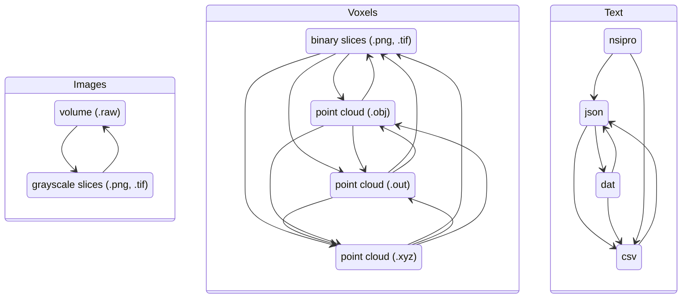

# Usage

## CLI

### Global options

```bash
rawtools -nfVvtRh
rawtools --dry-run
rawtools --force
rawtools --version
rawtools --verbose
rawtools --threads
rawtools --recursive
rawtools --help
```

## Convert

```bash
rawtools convert -h
```



## Supported Conversions

### Volume

| from / to | raw | png | tif |
| - |  -  |  -  |  -  |
|raw| Yes<sup>1</sup> | Yes | Yes |
|png| Yes | Yes<sup>1</sup> | Yes |
|tif| Yes | Yes | Yes<sup>1</sup> |

### Voxel

from / to|png|tif|obj|out|xyz
-----|-----|-----|-----|-----|-----
png|Yes<sup>1</sup>|Yes|Yes|Yes|Yes
tif|Yes|Yes<sup>1</sup>|Yes|Yes|Yes
obj|Yes|Yes|Yes<sup>1</sup>|Yes|Yes
out|Yes|Yes|Yes|Yes<sup>1</sup>|Yes
xyz|Yes|Yes|Yes|Yes|Yes<sup>1</sup>

<sup>1</sup> Used to convert between bit-depths (e.g., uint16/USHORT to uint8/UCHAR .raw). Though, be careful when performing lossy conversions (e.g., uint16 -> uint8).

### Metadata / Text

from / to|nsipro|csv|dat|json
-----|-----|-----|-----|-----
nsipro|-|Yes|No|Yes
csv|No|-|Yes|Yes
dat|No|Yes|-|Yes
json|No|Yes|Yes|-

### Basic usage: one volume to image slices

> **Note**
>
> Infers `--from` from file extension

```bash
rawtools convert --to png ./data.raw
rawtools convert --to png --bit-depth uint8 ./data.raw
rawtools convert -T png -b uint8 ./data.raw
```

### Basic usage: image slices to one volume

> **Note**
>
> Generates counterpart .dat file(s)

```bash
rawtools convert --to raw ./data/
rawtools convert --to obj ./data/  # point cloud
rawtools convert --to raw --bit-depth float32 ./data/
rawtools convert -T raw -b float32 ./data/
```

### Batch usage: many specified files

```bash
rawtools convert -T png 1.raw 2.raw
rawtools convert -T png *.raw
rawtools convert -T png ./data/*.raw
rawtools convert -T png {1..10}.raw
rawtools convert -T png {1,5,19}.obj
```

### Batch usage: folder

```bash
rawtools convert --recursive --from raw --to png ./data/
rawtools convert -R -F raw -T png ./data/
```

### Deprecated usage

```bash
raw2img ./data/  # assumes .raw to uint8 png image slices
```

## Quality Control

```bash
rawtools qc -h
```

### Generate projections

```bash
rawtools qc image --projection side --scale

# DEPRECATED
raw-qc -p side --scale data.raw
```

_MAYBE NOT_ -- out of scope?

### Validate file structure of NSI project folders (nested)

```bash
rawtools qc --validate-nsi-file-structure
```


## Library

_WIP_
