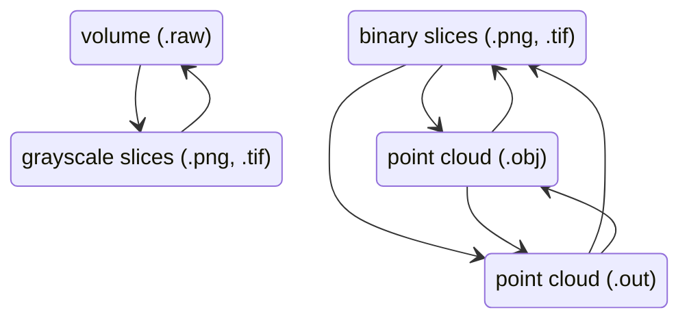

# Usage

## CLI

### Global options

```bash
rawtools -nfvh  # dryrun, force, verbose, help
```

## Convert

```bash
rawtools convert -h
```



### Basic usage: one volume to image slices

> **Note**
>
> Infers `--from` from file extension

```bash
rawtools convert --to png ./data.raw 
rawtools convert --to png --bit-depth uint8 ./data.raw 
rawtools convert -t png -b uint8 ./data.raw 
```

### Basic usage: image slices to one volume

> **Note**
>
> Generates counterpart .dat file(s)

```bash
rawtools convert --to raw ./data/
rawtools convert --to obj ./data/  # point cloud
rawtools convert --to raw --bit-depth float32 ./data/
rawtools convert -t raw -b float32 ./data/
```

### Batch usage: many specified files

```bash
rawtools convert -t png 1.raw 2.raw
rawtools convert -t png *.raw
rawtools convert -t png ./data/*.raw
rawtools convert -t png {1..10}.raw
rawtools convert -t png {1,5,19}.obj
```

### Batch usage: folder

```bash
rawtools convert --recursive --from raw --to png ./data/
rawtools convert -R -F raw -t png ./data/
```

### Deprecated usage

```bash
raw2img ./data/  # assumes .raw to uint8 png image slices
```

## Quality Control


## Library

_WIP_